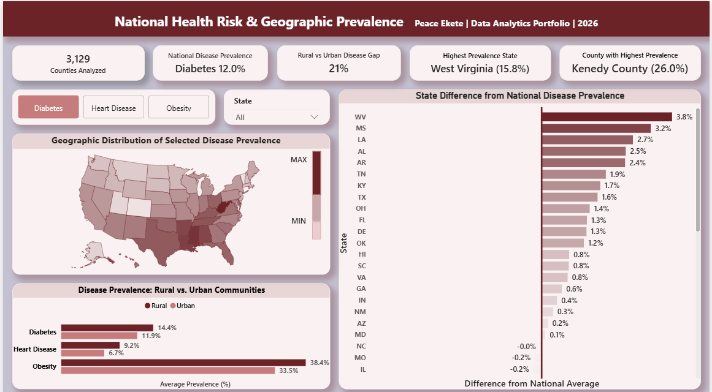
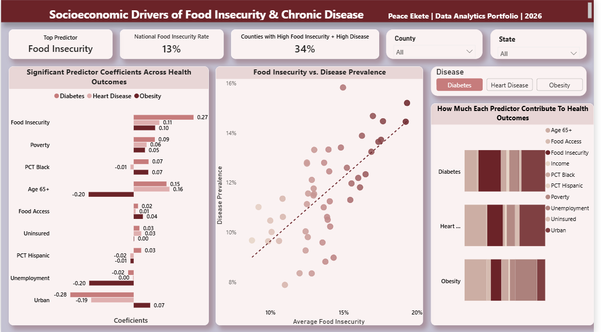
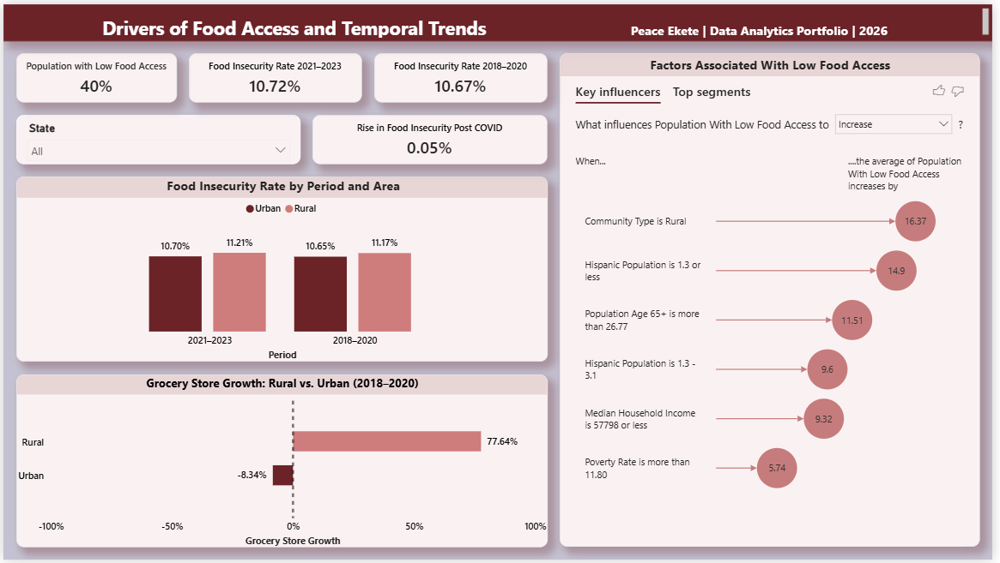
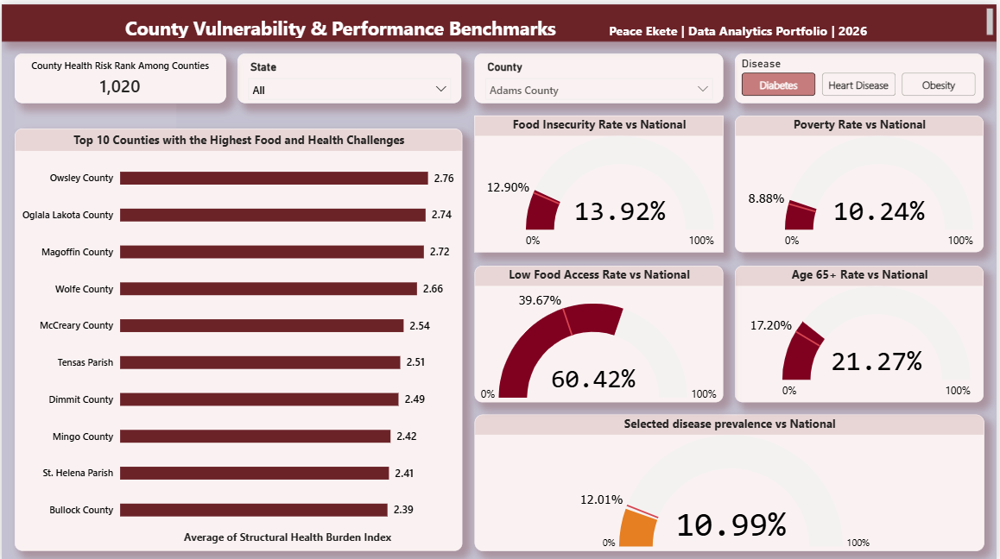

# Food Insecurity, Food Access, Chronic Disease & Community Health

Power BI health and socioeconomic analytics project examining food insecurity, chronic disease prevalence, and the socioeconomic and demographic factors associated with health outcomes across 3,129 U.S. counties.

# Project Overview

Food insecurity and chronic disease are closely connected to the social and economic conditions of the communities where people live. This project analyzes county-level data to examine how food insecurity, food access, poverty, income, insurance coverage, unemployment, age, race and ethnicity, and urban or rural location relate to the prevalence of diabetes, heart disease, and obesity.

The analysis covers 3,129 U.S. counties and combines statistical analysis with an interactive Power BI dashboard. The report allows users to compare disease prevalence across states and counties, examine differences from national averages, explore socioeconomic predictors, compare rural and urban communities, and identify counties with higher combined food and health challenges.

The project also uses multiple linear regression models to examine the relationship between the selected socioeconomic, demographic, food access, and food insecurity variables and each of the three health outcomes.

The Power BI report brings these analyses together across four pages, moving from national and geographic disease patterns to socioeconomic drivers, food access trends, and county-level comparisons.

# Problem

Food insecurity and chronic disease are often analyzed separately, which can make it difficult to understand how health outcomes vary across communities and which socioeconomic factors are associated with those differences.

This project was developed to examine these relationships at the county level and answer questions such as:

- How does chronic disease prevalence vary across U.S. states and counties?
- Which states and counties have disease prevalence above or below the national average?
- How does food insecurity relate to diabetes, heart disease, and obesity?
- Which socioeconomic and demographic factors are most strongly associated with each health outcome?
- How do food access and food insecurity differ between rural and urban communities?
- How did food insecurity and grocery-store availability change between the periods before and after COVID-19?
- Which counties have the highest combined food and health challenges?
- Where does a selected county rank relative to other counties based on its health-risk measure?

The goal was to bring these different perspectives together in one Power BI report so that the analysis could move from national and geographic patterns to potential socioeconomic drivers, and finally to county-level comparisons.

# Project Objectives

The objectives of this project were to:

- Analyze diabetes, heart disease, and obesity prevalence across 3,129 U.S. counties.
- Compare state and county disease prevalence with national averages.
- Examine the relationship between food insecurity and chronic disease prevalence.
- Identify socioeconomic, demographic, food access, and food insecurity variables associated with each health outcome.
- Compare food insecurity and food access between rural and urban communities.
- Examine food insecurity trends across the pre- and post-COVID periods.
- Analyze grocery-store growth across rural and urban communities.
- Identify counties experiencing higher levels of combined food and health challenges.
- Build an interactive Power BI dashboard that allows users to explore these patterns by disease, state, and county.

# Data and Analysis

The analysis combines data from multiple sources to examine food insecurity, food access, chronic disease, and the social and economic characteristics of communities across 3,129 U.S. counties.

The analysis uses descriptive statistics, geographic comparisons, correlation analysis, Key Influencers analysis, and multiple linear regression to examine patterns across the dataset.

# Data Sources

The project combines data from the following sources:

- CDC PLACES - chronic disease prevalence
- USDA Food Environment Atlas - food access, food insecurity, grocery stores, and related food-environment measures
- County Health Rankings & Roadmaps - health and socioeconomic indicators
- U.S. Census Bureau / American Community Survey (ACS) - demographic and socioeconomic characteristics
- Small Area Health Insurance Estimates (SAHIE) - health insurance coverage
- Food Access Research Atlas (FARA) - food access measures

The datasets were cleaned and combined in SQL before being used in Power BI so that the analysis could be performed consistently across the 3,129 counties.

# Regression Analysis

Three multiple linear regression models were developed to examine the factors associated with diabetes, heart disease, and obesity prevalence across the 3,129 counties.

Each model used the same 10 predictors:

Low Food Access
Median Household Income
Poverty
Uninsured Population
Unemployment
Population Age 65+
Black Population
Hispanic Population
Urban/Rural Classification
Food Insecurity

The models produced the following results:

| Health Outcome |    R² | Adjusted R² | Observations |
| -------------- | ----: | ----------: | -----------: |
| Diabetes       | 0.741 |       0.740 |        3,129 |
| Heart Disease  | 0.782 |       0.782 |        3,129 |
| Obesity        | 0.464 |       0.462 |        3,129 |

All three regression models were statistically significant overall.

# Diabetes

The diabetes model explained approximately 74.1% of the variation in diabetes prevalence.

Several predictors had statistically significant positive relationships with diabetes prevalence, including:

- Population Age 65+
- Black Population
- Food Insecurity
- Low Food Access
- Poverty
- Hispanic Population
- Uninsured Population

Median household income and urban classification had statistically significant negative coefficients.

Unemployment was not statistically significant at the 5% level.

# Heart Disease

The heart disease model had the highest explanatory power of the three models, with an R² of 0.782, meaning the model explained approximately 78.2% of the variation in heart disease prevalence.

Population Age 65+ had the strongest positive coefficient among the predictors. Food insecurity, poverty, uninsured population, and low food access were also positively associated with heart disease prevalence.

Median household income, Black population, Hispanic population, and urban classification had negative coefficients.

Unemployment was not statistically significant in this model.

# Obesity

The obesity model explained approximately 46.4% of the variation in obesity prevalence, substantially lower than the diabetes and heart disease models.

Low food access, poverty, Black population, and food insecurity had positive statistically significant coefficients.

Median household income, unemployment, population age 65+, and Hispanic population had negative statistically significant coefficients.

Uninsured population and urban classification were not statistically significant in the obesity model.

Comparing the Models

The results show that the same predictors do not have the same relationship with every health outcome.

Food insecurity was positively and statistically significantly associated with all three outcomes, although the size of the coefficient differed between the models.

Population Age 65+ showed a particularly strong positive relationship with diabetes and heart disease, but its coefficient was negative in the obesity model.

Median household income had a negative coefficient across all three models, while low food access had a positive coefficient across all three.

The models also differed in explanatory power. Heart disease had the highest R² at 78.2%, followed by diabetes at 74.1%, while obesity had a lower R² of 46.4%.

The regression results identify statistical associations within the available county data. They are not interpreted as evidence that any individual factor directly causes a health outcome.

# Dashboard Overview

# National Health & Geographic Patterns

The National Health & Geographic Patterns page provides an overview of chronic disease prevalence across the United States and examines how disease rates vary across states and counties.

A disease selector allows to switch between diabetes, heart disease, and obesity. The page also compares state and county disease prevalence with the corresponding national rate.

Questions answered include:

- How does the selected disease vary across the United States?
- Which states have higher or lower disease prevalence?
- How does a state's disease prevalence compare with the national rate?
- Which counties have higher or lower disease prevalence?
- How does the selected disease differ across geographic areas?

This page provides the starting point for understanding the geographic distribution of the three health outcomes before moving into the factors associated with those differences.

# Socioeconomic Factors & Health Outcomes

The Socioeconomic Factors & Health Outcomes page examines the factors associated with differences in diabetes, heart disease, and obesity prevalence. It combines the regression analysis with Key Influencers analysis to show how socioeconomic, demographic, food access, and food insecurity variables relate to the selected health outcome.

The regression section compares the direction, strength, and statistical significance of the predictors across the three health outcomes, while the Key Influencers analysis provides a closer look at the factors associated with the selected outcome.

Questions answered include:

- Which socioeconomic and demographic factors are most strongly associated with the selected health outcome?
- Which factors have positive or negative relationships with the health outcome?
- How do the important predictors differ between diabetes, heart disease, and obesity?
- How does food insecurity relate to chronic disease prevalence after accounting for the other predictors?
- Which factors are identified as important influences for the selected health outcome?

This page connects the geographic patterns shown on the first page with the socioeconomic and demographic factors associated with differences in health outcomes.

# Food Insecurity & Food Access

The Food Insecurity & Food Access page examines how food insecurity and access to food vary across communities and how these patterns differ between rural and urban areas.

The page also examines changes in food insecurity and grocery-store availability across different time periods, providing context for how the food environment has changed over time.

Key questions answered include:

- How does food insecurity vary across states and counties?
- How does food insecurity differ between rural and urban communities?
- How does low food access vary across communities?
- How has food insecurity changed across the different periods in the dataset?
- How has grocery-store availability changed over time?
- How does grocery-store growth differ between rural and urban communities?
- Which areas experience higher levels of food access and food insecurity?

This page provides additional context for the relationship between the food environment and the health outcomes examined throughout the report.

# County Health Risk Analysis

The County Health Risk Analysis page brings the county-level analysis together and focuses on identifying counties with higher health risk based on the measures used in the report.

The page provides county rankings, health-risk comparisons, and supporting indicators that help place an individual county in context relative to other counties.

Questions answered include:

- Where does a selected county rank among the 3,129 counties?
- How does the county's health risk compare with other counties?
- Is the county above or below the national health benchmark?
- What is the county's leading contributing factor based on the selected risk measures?
- What proportion of counties are above the national health average?
- How does the county's selected disease prevalence compare with the national rate?
- Which counties have the highest health-risk scores?

The page brings the analysis down to the county level, making it possible to move from broader state and national patterns to the specific characteristics and relative position of individual counties.

# Key Findings

The analysis revealed several important findings across chronic disease prevalence, food insecurity, food access, socioeconomic conditions, and geographic differences across U.S. counties.

- Rural counties recorded higher chronic disease prevalence than urban counties across all three health outcomes. Diabetes prevalence was 14.4% in rural counties compared with 11.9% in urban counties, while heart disease prevalence was 9.2% compared with 6.7%. Obesity prevalence was 38.4% in rural counties compared with 33.5% in urban counties.
- Heart disease showed the largest rural-urban difference, with a gap of approximately 23.27% between rural and urban counties.
- West Virginia recorded the largest state-level deviation from the national disease prevalence benchmark, at approximately 3.8 percentage points above the national average in the previous geographic analysis.
- Owsley County, Kentucky recorded the highest structural health-risk score in the previous county-level analysis, with a score of 2.76. The county also recorded 39.5% poverty, 90% food-access deprivation, and 17% diabetes prevalence, illustrating the concentration of multiple socioeconomic and health challenges within the same county.
- Food insecurity and chronic disease frequently overlap at the county level. The earlier analysis found that approximately 34% of counties had both above-median food insecurity and above-median disease prevalence.
- Food insecurity showed a positive relationship with diabetes prevalence, with the earlier correlation analysis reporting a correlation of approximately 0.47.
- Food access differed substantially between rural and urban communities. Grocery-store growth from 2016 to 2020 was approximately -8.34% in urban counties compared with +77.64% in rural counties.
- The regression models showed different levels of explanatory power across the three chronic diseases. The heart disease model had the highest R² at 0.782, followed by diabetes at 0.741, while obesity had an R² of 0.464. The adjusted R² values were 0.782, 0.740, and 0.462, respectively.
- The diabetes model identified several statistically significant positive predictors. Population Age 65+ had a coefficient of 0.1460, Black population had a coefficient of 0.0661, food insecurity had a coefficient of 0.2664, poverty had a coefficient of 0.0941, low food access had a coefficient of 0.0193, and uninsured population had a coefficient of 0.0255. Hispanic population also had a positive coefficient of 0.0333.
- Median household income had a negative coefficient of -0.0000185, while urban classification had a coefficient of -0.2821. Unemployment was not statistically significant at the 5% level.
- The heart disease model showed the strongest overall fit. Population Age 65+ had the largest positive coefficient at 0.1592, followed by food insecurity at 0.1142, poverty at 0.0574, and uninsured population at 0.0337. Low food access had a positive coefficient of 0.0084. Median household income, Black population, Hispanic population, and urban classification had negative coefficients. Unemployment was not statistically significant.
- The obesity model showed a different pattern from diabetes and heart disease. Food insecurity had a positive coefficient of 0.0954, low food access had a coefficient of 0.0409, poverty had a coefficient of 0.0501, and Black population had a coefficient of 0.0650. Median household income had a negative coefficient of -0.000125, while unemployment and Population Age 65+ also had negative coefficients. Uninsured population and urban classification were not statistically significant.
- Food insecurity was statistically significant in all three regression models. Its coefficient was 0.2664 for diabetes, 0.0954 for obesity, and 0.1142 for heart disease, showing that its estimated relationship with disease prevalence differed considerably across the three outcomes.
- Population Age 65+ was particularly important in the diabetes and heart disease models. Its coefficients were 0.1460 for diabetes and 0.1592 for heart disease, while the coefficient was -0.2006 in the obesity model. This difference demonstrates that the same predictor can have different relationships with different health outcomes.
- Median household income had a statistically significant negative coefficient in all three models, with coefficients of -0.0000185 for diabetes, -0.0000171 for heart disease, and -0.000125 for obesity.
- Low food access had a positive and statistically significant relationship across all three models, with coefficients of 0.0193 for diabetes, 0.0084 for heart disease, and 0.0409 for obesity.
- The demographic relationships also differed between the diseases. The Black population percentage had positive coefficients for diabetes (0.0661) and obesity (0.0650) but a negative coefficient for heart disease (-0.0143). Hispanic population had positive coefficients for diabetes (0.0333) but negative coefficients for obesity (-0.0144) and heart disease (-0.0151).
- The models were statistically significant overall, with an overall F-test significance of effectively 0 for diabetes, obesity, and heart disease.
- The county-level analysis ranks individual counties among the 3,129 counties included in the dataset, allowing a county's relative health-risk position to be examined alongside its disease prevalence, food insecurity, food access, poverty, and other socioeconomic measures.

Overall, the findings show substantial differences in chronic disease prevalence across U.S. counties and highlight the overlap between health outcomes, food insecurity, food access, socioeconomic conditions, and geography. The regression analysis further shows that these relationships vary by disease, with different predictors demonstrating different directions, strengths, and levels of statistical significance across diabetes, heart disease, and obesity.

# Conclusion

This project brings together chronic disease prevalence, food insecurity, food access, socioeconomic conditions, demographic characteristics, and geographic differences across 3,129 U.S. counties in one Power BI report.

The analysis shows that health outcomes vary substantially across communities and that the relationship between socioeconomic and food-related factors differs across diabetes, heart disease, and obesity. The regression models provide additional evidence of these differences, while the geographic and county-level analysis shows how those patterns are distributed across the country.

The dashboard brings these findings together through interactive geographic analysis, disease comparisons, food environment analysis, Key Influencers, regression results, and county-level health-risk analysis.

Rather than treating chronic disease as a single measure, the project examines the three outcomes separately and considers the different socioeconomic, demographic, and food-related factors associated with each one.

Thank you for taking the time to explore this project. Feedback and suggestions are always welcome.

You can connect with me on LinkedIn or reach me via email.

LinkedIn: https://linkedin.com/in/ekete-peace-a7837b275

Email: peaceekete8e@gmail.com

