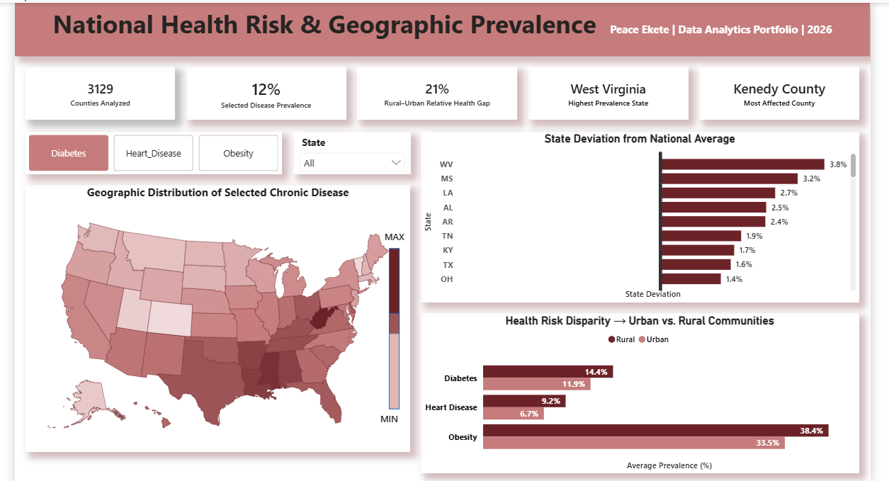
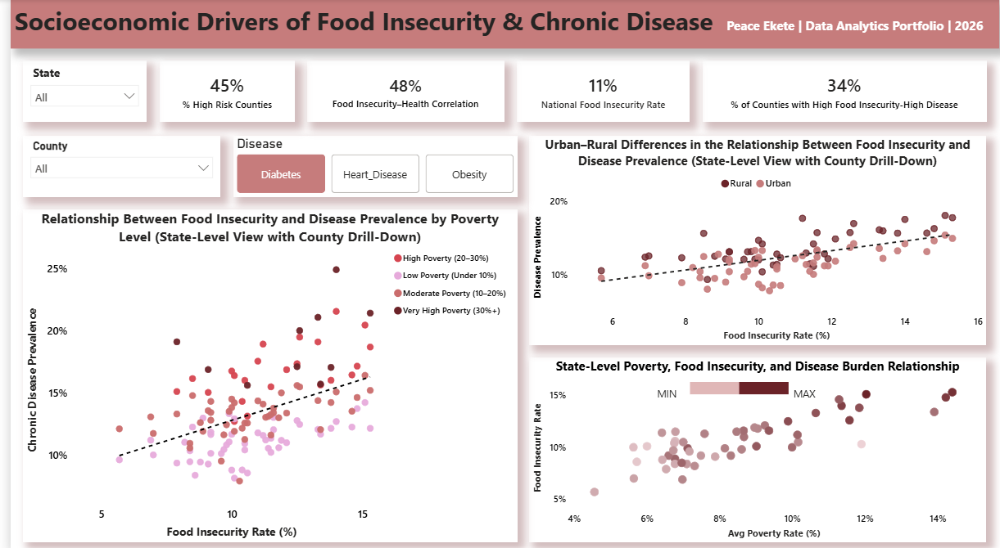
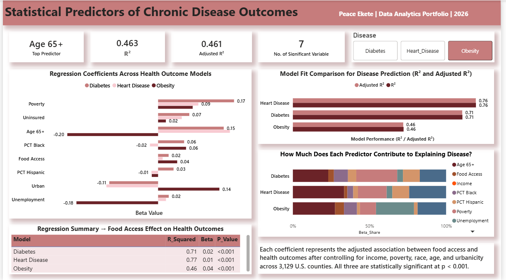
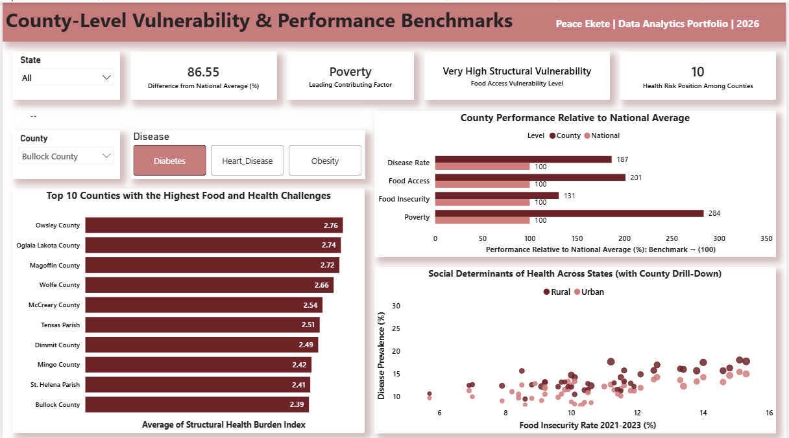
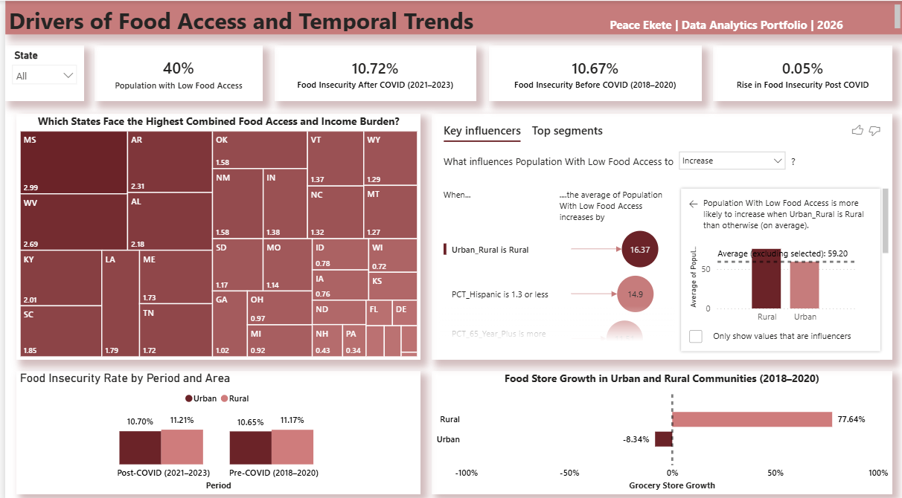

# food-access-food-insecurity-health-outcomes-us-counties
A five-page Power BI dashboard analyzing food access, food insecurity, poverty, and chronic disease outcomes across 3,129 U.S. counties using SQL, regression modeling, and DAX.

# Food Access, Insecurity, Poverty & Health Outcomes Across U.S. Counties

### A Five-Page Interactive Power BI Dashboard | 3,129 Counties | 9 Predictor Variables | 3 Regression Models

---

## Project Overview

This project investigates whether physical food access independently predicts chronic disease outcomes across U.S. counties — after controlling for poverty, income, race, age, insurance status, unemployment, and urbanicity. A lot of public health research treats food access and poverty as interchangeable. This analysis separates them.

The analysis integrates six public datasets across 3,129 U.S. counties, runs three multiple regression models in Excel, and visualizes the findings through a five-page interactive Power BI dashboard built entirely from scratch.

---

## Headline Finding

> Physical food access independently predicts diabetes, obesity, and coronary heart disease prevalence across 3,129 U.S. counties after controlling for poverty, income, race, age, insurance status, unemployment, and urbanicity. All three relationships are statistically significant at p < 0.001. Food access is not just a proxy for being poor — it contributes something on its own.

---

## Tools & Technologies

| Tool | Purpose |
|------|---------|
| MySQL 8.0 | Database construction, data cleaning, EDA across 3,129 county records |
| Excel | Multiple regression modeling across three disease outcomes |
| Power BI | Five-page interactive dashboard with slicers, drill-downs, and dynamic visuals |
| DAX | Population-weighted averages, Pearson correlation, Z-score composite index, dynamic SWITCH routing, TOPN ranking |

---

## Dataset

| Attribute | Detail |
|-----------|--------|
| File | master_county_final.csv |
| Geographic Coverage | 3,129 U.S. counties (50 states) |
| Predictor Variables | 9 socioeconomic and demographic variables |
| Source Datasets | FARA, FEA, CDC PLACES, CHR, ACS, SAHIE |
| Time Period | 2016–2023 |

### Source Datasets
- **FARA** — Food Access Research Atlas (USDA) — food access deprivation by county
- **FEA** — Food Environment Atlas (USDA) - grocery store counts and growth rates
- **CDC PLACES** — County-level chronic disease prevalence (diabetes, obesity, heart disease)
- **CHR** — County Health Rankings — socioeconomic indicators
- **ACS** — American Community Survey - demographics, income, population
- **SAHIE** — Small Area Health Insurance Estimates — uninsurance rates

---

## Regression Models

| Model | R² | Adjusted R² | Significant Variables | Strongest Predictor |
|-------|-----|-------------|----------------------|-------------------|
| Diabetes | 0.708 | 0.707 | 8 of 9 | Poverty Rate (β = 0.168) |
| Obesity | 0.463 | 0.461 | 7 of 9 | Senior Population % (β = −0.201) |
| Heart Disease | 0.765 | 0.764 | 9 of 9 | Senior Population % (β = 0.159) |

### Food Access Effect Across All Three Models

| Model | Beta | P-Value |
|-------|------|---------|
| Diabetes | 0.023 | < 0.001 |
| Obesity | 0.042 | < 0.001 |
| Heart Disease | 0.010 | < 0.001 |

Food access survives every socioeconomic control in all three models. The beta coefficients are modesT poverty and age are stronger drivers — but the relationships are statistically significant across all outcomes.

---

## Dashboard Pages

### Page 1 — National Health Risk & Geographic Prevalence
*Where is the health burden worst and how does it differ between urban and rural America?*
- Choropleth map showing disease distribution across all 50 states
- State deviation from national average diverging bar chart
- Urban vs. rural health outcomes across all three diseases simultaneously
- KPIs: Counties analyzed, selected disease prevalence, rural-urban health gap, highest burden state, most affected county

### Page 2 — Socioeconomic Drivers of Food Insecurity & Chronic Disease

*Does food insecurity predict disease — or is poverty doing all the work?*
- County-level scatter: food insecurity vs. disease prevalence colored by poverty tier
- Urban vs. rural scatter: does the food insecurity-disease relationship hold across both community types?
- State-level scatter: average poverty vs. average food insecurity colored by disease burden
- KPIs: High risk county percentage, Pearson correlation coefficient, national food insecurity rate, percentage of counties with compounding high insecurity and high disease burden

### Page 3 — Statistical Predictors of Chronic Disease Outcomes

*What actually drives chronic disease after controlling for everything?*
- Regression coefficients diverging bar chart across all three models simultaneously
- Model fit comparison R² and Adjusted R² side by side
- Predictor contribution stacked bar — relative weight of each variable per model
- Regression summary table food access beta and p-value per model
- KPIs: Top predictor, R², Adjusted R², number of significant variables

### Page 4 — County-Level Vulnerability & Performance Benchmarks

*Which counties face the highest combined structural risk and how does any county compare to the national benchmark?*
- Top 10 counties ranked by composite structural risk index
- County vs. national benchmark chart disease rate, food access, food insecurity, and poverty indexed to 100
- Social determinants scatter food insecurity vs. disease prevalence by urbanicity
- KPIs: Health risk rank among 3,129 counties, vulnerability classification, difference from national average, leading contributing factor

### Page 5 — Drivers of Food Access & Temporal Trends

*Where does physical food access break down and did COVID make it worse?*
- Treemap: states facing the highest combined food access and income burden
- Key Influencers visual: what drives population with low food access to increase
- Pre vs. post-COVID food insecurity comparison by urban and rural communities
- Grocery store growth 2016–2020 by urbanicity diverging bar chart
- KPIs: Population with low food access, food insecurity before and after COVID, rise post-COVID

---

## Key Findings

- Food access independently predicts all three chronic diseases after controlling for every major socioeconomic and demographic variable it is not just a poverty proxy
- Poverty rate is the strongest single predictor of diabetes (β = 0.168) stronger than food access, race, or insurance status
- Food insecurity correlates most strongly with diabetes (r = 0.48) the most directly food-sensitive disease because blood sugar regulation depends on nutritional consistency
- 34% of U.S. counties simultaneously have above-median food insecurity and above-median disease rates these counties are not trending toward crisis, they are already in one
- Rural counties have **23.27% higher heart disease rates** than urban counties the largest disparity across all three outcomes
- Heart disease is 76.5% structurally explained social and economic conditions nearly fully determine where it concentrates geographically
- Obesity is the outlier at 46.3% counties with larger senior populations and higher unemployment actually show lower obesity rates, pointing to behavioral and cultural factors that county-level data cannot capture
- West Virginia sits **3.8 percentage points above the national average** the highest state deviation in the dataset, followed by Mississippi, Louisiana, Alabama, and Arkansas
- Owsley County, Kentucky scores highest on the composite structural risk index (2.76) 39.5% poverty, 90% food access deprivation, 17% diabetes
- Urban counties lost **8.34% of grocery stores between 2016 and 2020** before COVID arrived while rural counties grew at +77.64%. The food access crisis is structural, not pandemic-driven
- Once poverty and income are fully controlled, the share of Black residents flips negative in the heart disease model racial health disparities in this dataset are driven by structural conditions, not biological difference
- Vermont has 74% of residents beyond 1 mile from a grocery store yet maintains low disease rates — income, education, and healthcare access buffer physical food distance for wealthier populations in ways that low-income rural counties cannot replicate

---

## Insights

This analysis examined food access, food insecurity, poverty, and chronic disease outcomes across 3,129 U.S. counties using six integrated datasets, three regression models, and nine predictor variables. The findings reveal that where Americans live and what structural conditions surround them largely determines how sick they get.

**Food access independently drives disease**
Physical food access independently predicts diabetes, obesity, and heart disease after controlling for poverty, income, race, age, insurance, unemployment, and urbanicity. The effect survives every control variable. It is not a poverty proxy it does its own work.

**Food insecurity and disease are tightly linked**
Food insecurity correlates most strongly with diabetes (r = 0.48) the most directly food-sensitive condition because blood sugar regulation depends on nutritional consistency. 34% of U.S. counties simultaneously have above-median food insecurity and above-median disease rates. These counties are not at risk of a crisis they are already in one.

**Poverty is the single strongest driver of diabetes**
Poverty rate has the highest beta coefficient in the diabetes model (β = 0.168), outweighing food access, race, age, and every other variable. Food access matters independently but poverty dominates. Addressing food access without addressing income deprivation will produce limited results.

**The rural-urban gap is large, consistent, and disease-specific**
Rural counties have 14.4% diabetes vs. 11.9% urban, 9.2% heart disease vs. 6.7% urban, and 38.4% obesity vs. 33.5% urban. The gap is widest for heart disease rural counties are 23.27% worse than urban. Obesity shows the smallest gap at 2.16%, meaning obesity is distributed more evenly across America while the downstream consequences of poor nutrition concentrate in rural communities.

**Heart disease is almost entirely structurally explained**
The heart disease model explains 76.5% of county-level variance. Social and economic conditions nearly fully explain where heart disease concentrates geographically. Diabetes sits at 70.8%. Obesity is the outlier at 46.3%, suggesting it is shaped by behavioral and cultural factors that county-level data cannot capture. Counties with larger senior populations actually show lower obesity rates, and counties with higher unemployment also show lower obesity both reversals that do not appear in the other models.

**The Deep South and Appalachia carry the heaviest burden**
West Virginia sits 3.8 percentage points above the national average the highest state deviation in the dataset. Mississippi, Louisiana, Alabama, and Arkansas follow. These states dominate every high-burden ranking across all three diseases simultaneously. Owsley County, Kentucky scores highest on the composite structural risk index at 2.76 with 39.5% poverty, 90% food access deprivation, and 17% diabetes — making it the most structurally vulnerable county in the nation.

**Urban food infrastructure was already collapsing before COVID**
Between 2016 and 2020 before any pandemic urban counties averaged −8.34% grocery store growth while rural counties grew at +77.64%. COVID landed on infrastructure that was already weakening. The population-weighted national rise of 0.05 percentage points obscures the real story unweighted across all communities equally, food insecurity rose 1.44 percentage points, meaning smaller and rural counties absorbed the majority of the deterioration.

**Structural conditions explain race, not biology**
The share of Black residents in a county is positively associated with diabetes and obesity but flips negative in the heart disease model after full socioeconomic controls are applied. Once poverty and income are fully accounted for, the racial gap in heart disease reverses direction. This confirms that racial health disparities in this dataset are driven by structural conditions concentrated poverty, food insecurity, and limited access not biological difference.

**Physical distance is not destiny**
Vermont has 74% of its population living more than 1 mile from a grocery store yet records some of the lowest disease rates in the dataset. This does not invalidate the findings it reveals what income, education, and healthcare quality can do as protective factors. Higher-income populations compensate through car ownership, delivery access, and healthcare utilization. Low-income rural populations cannot. These counties point to the protective conditions worth replicating in high-risk regions.

---

## Recommendations

**1. Deploy mobile food programs and SNAP outreach as a coordinated package in double-burden counties**
The 34% of counties with simultaneously high food insecurity and high disease rates need coordinated intervention now. Mobile grocery units, SNAP enrollment drives, and community health workers should be deployed together not as separate programs because each addresses a different layer of the same compounding problem. Deploying them in isolation allows the untreated layers to undermine whatever progress the others make.

**2. Expand SNAP eligibility and increase benefit levels in high-poverty counties**
Poverty is the strongest predictor of diabetes in this dataset. SNAP expansion directly reduces poverty's grip on food access and nutrition quality. States with the highest poverty-disease overlap West Virginia, Mississippi, Louisiana, Alabama, and Arkansas should be prioritized for accelerated benefit expansion.

**3. Introduce urban grocery retention incentives at the municipal level**
Urban counties were losing stores before COVID arrived. City governments should introduce tax incentives, zoning protections, and below-market lease programs to retain grocery stores in low-income urban neighborhoods treating store retention as public health infrastructure rather than retail policy.

**4. Fund rural healthcare infrastructure alongside food access programs**
The 23.27% rural-urban heart disease gap cannot be closed by food access improvements alone. Rural counties need co-investment in cardiovascular care, preventive screening, and telehealth infrastructure alongside any food access program. Treating them as separate policy areas will produce results that fall short of what the data suggests is possible.

**5. Replace short-term disease metrics with intermediate outcome tracking**
Chronic disease takes years to develop and years to reverse. Measuring a food access program's success by diabetes rate reduction after two years sets it up to appear ineffective even when it is working. Policymakers should track food insecurity rates, grocery utilization, and diet quality scores as primary metrics with disease outcomes measured over a 10-year horizon minimum.

**6. Commission targeted research into high-access, low-disease counties**
Counties with poor physical food access but low disease rates are telling us something important about what else matters income levels, healthcare quality, food culture, and education. Understanding what specifically protects these communities could reveal transferable lessons for high-risk regions facing similar geographic barriers but far worse socioeconomic conditions.

---

## Methodology Notes

- All health prevalence figures are age-adjusted and sourced from CDC PLACES and County Health Rankings
- Food access is measured using the USDA 1-mile urban threshold a physical proximity measure that does not capture transportation access, store quality, or affordability
- Population-weighted averages are used throughout for all national and state-level KPIs to prevent small rural counties from distorting aggregate figures
- The composite structural risk index combines Z-scores for disease prevalence, food insecurity, food access deprivation, and poverty rate into a single standardized index
- Risk tier thresholds and quadrant classifications are analyst-defined based on data distribution quartiles and are not externally validated clinical benchmarks
- All regression models were estimated in Excel using OLS with 9 predictors across 3,129 observations
- 16 counties were removed during cleaning due to FARA geography mismatches, suppressed SAHIE estimates, and confirmed ACS data errors

---
